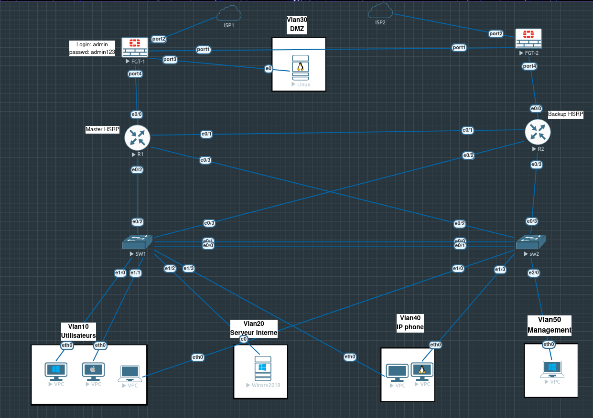
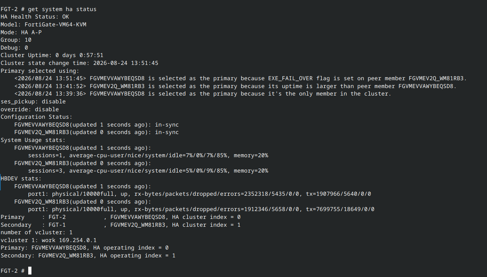
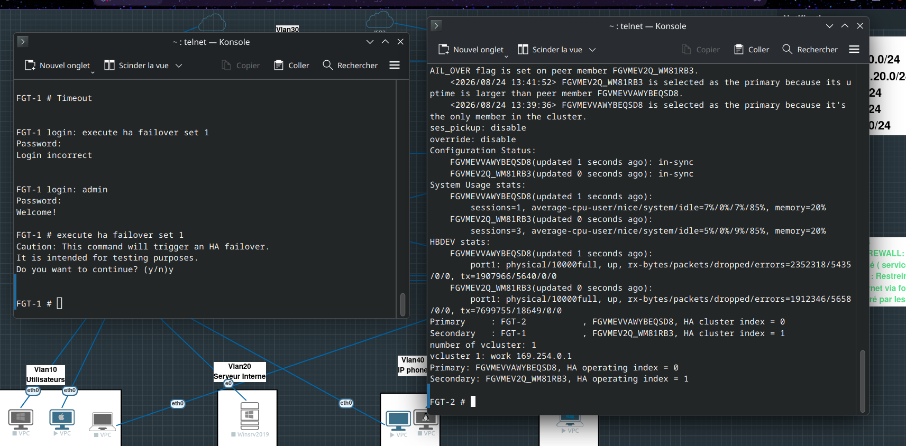

# Rapport de Travaux Pratiques
# Infrastructure Réseau Haute Disponibilité
# Cluster FortiGate HA & Redondance HSRP sous EVE-NG

---

| | |
|:---|:---|
| **Module** | Sécurité Réseau & Infrastructure |
| **Plateforme** | EVE-NG Community |
| **Date** | Août 2026 |
| **Niveau** | Avancé |
| **Durée estimée** | 6 à 8 heures |

---

## Table des Matières

1. [Introduction & Objectifs](#1-introduction--objectifs)
2. [Architecture & Plan d'Adressage IP](#2-architecture--plan-dadressage-ip)
3. [Description de la Topologie Réseau](#3-description-de-la-topologie-réseau)
4. [Guide de Configuration Étape par Étape](#4-guide-de-configuration-étape-par-étape)
5. [Validation, Diagnostic & Tests de Haute Disponibilité](#5-validation-diagnostic--tests-de-haute-disponibilité)
6. [Conclusion Technique](#6-conclusion-technique)

---

## 1. Introduction & Objectifs

### 1.1 Contexte

La disponibilité des services réseau est une exigence fondamentale dans les environnements d'entreprise modernes. Une interruption, même brève, peut entraîner des pertes financières considérables et porter atteinte à la réputation d'une organisation. Ce Travaux Pratiques s'inscrit dans cette réalité en proposant de concevoir, déployer et valider une **infrastructure réseau d'entreprise résiliente**, simulée dans l'environnement d'émulation **EVE-NG**.

Ce lab aborde la haute disponibilité à deux niveaux complémentaires et critiques : le périmètre de sécurité avec un **cluster FortiGate en mode Actif/Passif**, et le cœur de réseau Layer 3 avec le protocole **HSRP** (Hot Standby Router Protocol) entre deux routeurs Cisco. La segmentation du réseau est assurée par un plan **VLAN** structuré couvrant les usages typiques d'une entreprise.

### 1.2 Objectifs Pédagogiques

À l'issue de ce TP, l'étudiant sera capable de :

- Comprendre et expliquer le fonctionnement d'un cluster FortiGate en mode **Actif/Passif (HA A/P)**
- Configurer l'ensemble des paramètres HA via la **CLI FortiOS** (group-id, priority, hbdev, session-pickup)
- Décrire le mécanisme d'élection du nœud **Primary** et les facteurs déterminants (priority, uptime, flags)
- Mettre en œuvre le protocole **HSRP** pour assurer la redondance de la passerelle par défaut
- Concevoir et implémenter un plan de **segmentation VLAN** adapté aux besoins métier
- Exécuter et analyser un **test de failover** en conditions contrôlées
- Interpréter les sorties des commandes de diagnostic `get system ha status` et `diagnose sys ha checksum cluster`

### 1.3 Objectifs Techniques

| Objectif | Technologie | Validation |
|:---|:---|:---|
| Redondance firewall | FortiGate HA Actif/Passif | `get system ha status` |
| Redondance passerelle | HSRP Cisco IOS | `show standby brief` |
| Isolation des flux | VLANs 802.1Q | Ping inter-VLAN contrôlé |
| Distribution d'adresses DMZ | DHCP FortiGate | Bail DHCP serveur Linux |
| Bascule sans interruption | Session Pickup HA | Test failover manuel |

---

## 2. Architecture & Plan d'Adressage IP

### 2.1 Vue Globale de l'Infrastructure

L'infrastructure déployée dans ce lab reproduit fidèlement une architecture d'entreprise à trois couches : **périmètre de sécurité**, **cœur de réseau**, et **accès/distribution**.


*Figure 1 — Topologie complète du lab sous EVE-NG*

### 2.2 Inventaire des Équipements

| Équipement | Rôle | Image EVE-NG | Quantité |
|:---|:---|:---|:---:|
| **FGT-1** | Firewall HA Primary (initial) | FortiGate-VM64-KVM | 1 |
| **FGT-2** | Firewall HA Secondary | FortiGate-VM64-KVM | 1 |
| **R1** | Routeur HSRP Master | Cisco IOSv | 1 |
| **R2** | Routeur HSRP Backup | Cisco IOSv | 1 |
| **SW1** | Switch distribution/accès | Cisco IOU L2 | 1 |
| **SW2** | Switch distribution/accès | Cisco IOU L2 | 1 |
| **Linux** | Serveur DMZ | Ubuntu/Linux | 1 |
| **Winsrv2019** | Serveur interne | Windows Server 2019 | 1 |
| **VPC** | Postes clients | VPC (VPCS) | 5 |

### 2.3 Plan d'Adressage IP Complet

#### Interfaces FortiGate

| Interface | Rôle | FGT-1 | FGT-2 | Sous-réseau |
|:---|:---|:---|:---|:---|
| `port1` | Heartbeat HA & Sync | `169.254.0.1/24` | `169.254.0.2/24` | `169.254.0.0/24` |
| `port2` | WAN / Management | DHCP (ISP1) | DHCP (ISP2) | Externe |
| `port3` | DMZ Gateway | `192.168.30.254/24` | (synchronisée) | `192.168.30.0/24` |
| `port4` | Réservé | — | — | — |

#### VLANs & Segments LAN

| VLAN ID | Nom | Sous-réseau | Passerelle (VIP HSRP) | Plage DHCP | Équipements |
|:---:|:---|:---|:---|:---|:---|
| **10** | Utilisateurs | `192.168.10.0/24` | `192.168.10.254` | `.10` → `.200` | VPC Windows, macOS, Linux |
| **20** | Serveurs Internes | `192.168.20.0/24` | `192.168.20.254` | Statique | Windows Server 2019 |
| **30** | DMZ | `192.168.30.0/24` | `192.168.30.254` | `.10` → `.50` (DHCP FW) | Serveur Linux public |
| **40** | IP Phone | `192.168.40.0/24` | `192.168.40.254` | `.10` → `.150` | Téléphones IP |
| **50** | Management | `192.168.50.0/24` | `192.168.50.254` | Statique | Poste administration |

#### Routeurs HSRP

| Équipement | Interface | IP Physique | VIP HSRP | Priority | Rôle |
|:---|:---|:---|:---|:---:|:---|
| **R1** | `e0/1`, `e0/2`, `e0/3` | `192.168.x.1` | `192.168.x.254` | **110** | Master HSRP |
| **R2** | `e0/1`, `e0/2`, `e0/3` | `192.168.x.2` | `192.168.x.254` | **100** | Backup HSRP |

#### Paramètres du Cluster HA FortiGate

| Paramètre | Valeur |
|:---|:---|
| **Group ID** | `10` |
| **Group Name** | `LAB-HA-CLUSTER` |
| **Mode** | `Active-Passive (a-p)` |
| **Heartbeat Interface** | `port1` (poids 50) |
| **Sous-réseau Heartbeat** | `169.254.0.0/24` |
| **Priority FGT-1** | `200` (Master initial) |
| **Priority FGT-2** | `100` (Slave initial) |
| **Override** | `disable` |
| **Session Pickup** | `enable` |

---

## 3. Description de la Topologie Réseau

### 3.1 Couche de Sécurité — Cluster FortiGate HA

Le périmètre de sécurité est assuré par **deux FortiGate virtuels (FGT-1 et FGT-2)** fonctionnant en cluster Haute Disponibilité de type **Actif/Passif**. Dans ce modèle, un seul nœud (le *Primary*) traite activement l'intégralité du trafic réseau, tandis que le second nœud (le *Secondary*) reste en veille synchronisée, prêt à prendre le relais instantanément en cas de défaillance.

**Rôles des interfaces FortiGate :**

- **`port1` (Heartbeat)** : Interface dédiée à la communication inter-nœuds sur le sous-réseau `169.254.0.0/24`. Elle véhicule les battements de cœur (*heartbeats*) permettant la détection de panne, ainsi que la **synchronisation bidirectionnelle** des bases de données de configuration et des tables de session.
- **`port2` (WAN)** : Interface connectée aux fournisseurs d'accès Internet. FGT-1 est raccordé à ISP1, FGT-2 à ISP2, ce qui confère également une redondance au niveau de la connectivité internet.
- **`port3` (DMZ)** : Interface de la zone démilitarisée, connectée au serveur Linux. Le FortiGate fait office de passerelle par défaut (`192.168.30.254`) et de serveur DHCP pour ce segment.

Les deux FortiGate sont accessibles via leur interface `port2` aux adresses configurées, avec les identifiants `admin / admin123` pour FGT-1, comme indiqué dans la topologie EVE-NG.

### 3.2 Cœur de Réseau Layer 3 — Routeurs R1 & R2 avec HSRP

Les deux routeurs Cisco **R1** et **R2** constituent le cœur de réseau Layer 3. Leur mission principale est d'assurer le routage inter-VLAN et de fournir une **passerelle par défaut hautement disponible** aux postes clients via le protocole **HSRP** (Hot Standby Router Protocol, RFC 2281).

**Principe de fonctionnement HSRP :**
HSRP crée une **adresse IP virtuelle (VIP)** partagée entre R1 et R2. Les postes clients configurent cette VIP comme passerelle. En temps normal, R1 (priority 110, *Master HSRP*) répond à l'ARP de la VIP. Si R1 devient inaccessible, R2 (priority 100, *Backup HSRP*) prend automatiquement en charge la VIP, assurant la continuité du routage sans reconfiguration des postes clients.

La topologie révèle des liens croisés entre R1/R2 et SW1/SW2, ce qui renforce la résilience en éliminant les points de défaillance uniques (*SPOF*) au niveau des liens physiques.

### 3.3 Couche de Distribution & Accès — SW1 & SW2

Les deux switches **SW1** et **SW2** opèrent en couche 2 (Layer 2). Leur rôle est de :

1. **Agréger** les liaisons montantes vers R1 et R2 en trunk 802.1Q
2. **Distribuer** le trafic vers les équipements d'accès selon leur VLAN d'appartenance
3. **Interconnecter** les deux châssis pour assurer la redondance des liens de distribution

L'interconnexion entre SW1 et SW2 (liens `e0/0`, `e0/3`, `e0/4`) suggère une configuration **EtherChannel ou Spanning Tree** pour prévenir les boucles tout en permettant la redondance.

### 3.4 Segmentation par VLANs

| VLAN | Justification métier |
|:---|:---|
| **VLAN 10 — Utilisateurs** | Isolation des postes de travail (Windows, macOS, Linux). Politique de sécurité restrictive vers DMZ et Serveurs. |
| **VLAN 20 — Serveurs** | Zone serveur interne (Windows Server 2019). Accès contrôlé depuis le VLAN Utilisateurs uniquement. |
| **VLAN 30 — DMZ** | Zone tampon entre Internet et le réseau interne. Le serveur Linux y expose des services publics sous contrôle strict du FortiGate. |
| **VLAN 40 — IP Phone** | Isolation de la téléphonie IP pour garantir la qualité de service (QoS) et prévenir les attaques VLAN hopping. |
| **VLAN 50 — Management** | Accès exclusivement dédié à l'administration des équipements. Filtrage strict, accès SSH uniquement. |

---

## 4. Guide de Configuration Étape par Étape

### 4.1 Configuration des Interfaces FortiGate

#### 4.1.1 Interface DMZ (port3)

Se connecter à FGT-1 via SSH ou console :

```bash
FGT-1 # config system interface
FGT-1 (interface) # edit "port3"
FGT-1 (port3) #     set alias "DMZ-VLAN30"
FGT-1 (port3) #     set ip 192.168.30.254 255.255.255.0
FGT-1 (port3) #     set allowaccess ping https ssh http
FGT-1 (port3) #     set role lan
FGT-1 (port3) #     set description "Interface DMZ - Serveur Linux"
FGT-1 (port3) # next
FGT-1 (interface) # end
```

**Vérification :**

```bash
FGT-1 # show system interface port3
```

#### 4.1.2 Serveur DHCP pour la zone DMZ

```bash
FGT-1 # config system dhcp server
FGT-1 (server) # edit 1
FGT-1 (1) #     set status enable
FGT-1 (1) #     set interface "port3"
FGT-1 (1) #     set default-gateway 192.168.30.254
FGT-1 (1) #     set netmask 255.255.255.0
FGT-1 (1) #     set lease-time 86400
FGT-1 (1) #     config dns-server
FGT-1 (dns-server) #         edit 1
FGT-1 (1) #             set server 8.8.8.8
FGT-1 (1) #         next
FGT-1 (dns-server) #     end
FGT-1 (1) #     config ip-range
FGT-1 (ip-range) #         edit 1
FGT-1 (1) #             set start-ip 192.168.30.10
FGT-1 (1) #             set end-ip   192.168.30.50
FGT-1 (1) #         next
FGT-1 (ip-range) #     end
FGT-1 (1) # next
FGT-1 (server) # end
```

**Vérification des baux DHCP actifs :**

```bash
FGT-1 # diagnose sys dhcp server list
```

### 4.2 Configuration du Cluster HA FortiGate

> ⚠️ **Ordre de configuration** : Configurer d'abord **FGT-2 (Slave)**, puis **FGT-1 (Master)**. Lors de l'activation du HA sur FGT-1, le cluster se forme immédiatement. FGT-2, déjà configuré, sera reconnu comme membre secondaire.

#### 4.2.1 Configuration de FGT-1 — Nœud Master (Priority 200)

```bash
FGT-1 # config system ha
FGT-1 (ha) #     set group-id 10
FGT-1 (ha) #     set group-name "LAB-HA-CLUSTER"
FGT-1 (ha) #     set mode a-p
FGT-1 (ha) #     set hbdev "port1" 50
FGT-1 (ha) #     set override disable
FGT-1 (ha) #     set priority 200
FGT-1 (ha) #     set session-pickup enable
FGT-1 (ha) #     set session-pickup-connectionless enable
FGT-1 (ha) #     set ha-mgmt-status disable
FGT-1 (ha) # end
```

> **Note** : Après la commande `end`, FortiGate redémarre le sous-système HA. La connexion CLI sera temporairement interrompue. C'est un comportement normal.

**Explication des paramètres :**

| Paramètre | Valeur | Explication |
|:---|:---|:---|
| `group-id` | `10` | Identifiant numérique du cluster. Doit être identique sur les deux membres. |
| `group-name` | `LAB-HA-CLUSTER` | Nom du cluster. Doit être identique sur les deux membres. |
| `mode` | `a-p` | Active-Passive : un seul membre traite le trafic à la fois. |
| `hbdev` | `port1 50` | Interface de heartbeat avec un poids de 50. |
| `override` | `disable` | Désactivé : le nœud repris ne redevient pas Primary automatiquement après son retour. |
| `priority` | `200` | Priorité élevée : ce nœud sera élu Primary lors de la formation initiale du cluster. |
| `session-pickup` | `enable` | Les sessions TCP/UDP actives sont maintenues lors d'un failover (reprise transparente). |

#### 4.2.2 Configuration de FGT-2 — Nœud Slave (Priority 100)

```bash
FGT-2 # config system ha
FGT-2 (ha) #     set group-id 10
FGT-2 (ha) #     set group-name "LAB-HA-CLUSTER"
FGT-2 (ha) #     set mode a-p
FGT-2 (ha) #     set hbdev "port1" 50
FGT-2 (ha) #     set override disable
FGT-2 (ha) #     set priority 100
FGT-2 (ha) #     set session-pickup enable
FGT-2 (ha) #     set session-pickup-connectionless enable
FGT-2 (ha) # end
```

> La seule différence avec FGT-1 est la **`priority 100`** (versus 200), qui garantit que FGT-1 sera élu Primary lors de la formation du cluster.

#### 4.2.3 Vérification de la Formation du Cluster

Après quelques secondes, vérifier sur le Primary (FGT-1) :

```bash
FGT-1 # get system ha status

HA Health Status: OK
Mode: HA A-P
Group: 10
...
Configuration Status:
    FGVM... (FGT-1): in-sync
    FGVM... (FGT-2): in-sync
Primary   : FGT-1
Secondary : FGT-2
```

Les deux membres doivent apparaître avec le statut **`in-sync`**.

### 4.3 Configuration HSRP sur les Routeurs Cisco

#### 4.3.1 R1 — Master HSRP

```cisco
R1# configure terminal
R1(config)# interface Ethernet0/1
R1(config-if)#  description "Lien vers SW1 - VLAN 10 Trunk"
R1(config-if)#  ip address 192.168.10.1 255.255.255.0
R1(config-if)#  standby version 2
R1(config-if)#  standby 10 ip 192.168.10.254
R1(config-if)#  standby 10 priority 110
R1(config-if)#  standby 10 preempt delay minimum 30
R1(config-if)#  standby 10 track Ethernet0/0 20
R1(config-if)#  no shutdown

! Répéter pour VLAN 20, 40, 50 avec les sous-interfaces appropriées
R1(config)# end
R1# write memory
```

#### 4.3.2 R2 — Backup HSRP

```cisco
R2# configure terminal
R2(config)# interface Ethernet0/1
R2(config-if)#  description "Lien vers SW2 - VLAN 10 Trunk"
R2(config-if)#  ip address 192.168.10.2 255.255.255.0
R2(config-if)#  standby version 2
R2(config-if)#  standby 10 ip 192.168.10.254
R2(config-if)#  standby 10 priority 100
R2(config-if)#  standby 10 preempt
R2(config-if)#  no shutdown
R2(config)# end
R2# write memory
```

**Vérification HSRP :**

```cisco
R1# show standby brief

                     P indicates configured to preempt.
Interface   Grp  Pri P State   Active          Standby         Virtual IP
Et0/1       10   110 P Active  local           192.168.10.2    192.168.10.254
```

---

## 5. Validation, Diagnostic & Tests de Haute Disponibilité

### 5.1 Commandes de Diagnostic HA

#### 5.1.1 `get system ha status` — État général du cluster

Cette commande est la principale source d'information sur l'état du cluster HA. Elle retourne l'ensemble des paramètres opérationnels du groupe HA.

```bash
FGT-2 # get system ha status
```


*Figure 2 — Sortie de `get system ha status` après le test de failover (FGT-2 est devenu Primary)*

**Analyse détaillée de la sortie :**

| Champ | Valeur observée | Interprétation |
|:---|:---|:---|
| `HA Health Status` | `OK` | Le cluster fonctionne normalement, aucune anomalie détectée. |
| `Model` | `FortiGate-VM64-KVM` | Modèle virtuel KVM, cohérent avec l'environnement EVE-NG. |
| `Mode` | `HA A-P` | Confirmation du mode Actif/Passif. |
| `Group` | `10` | Correspond au `group-id` configuré. |
| `Cluster Uptime` | `0 days 0:57:51` | Le cluster est formé depuis environ 58 minutes. |
| `Configuration Status` | `in-sync` (×2) | **Critique** : les deux membres ont une configuration identique et synchronisée. ✅ |
| `Primary` | `FGT-2` | Après le failover, FGT-2 a pris le rôle de Primary. |
| `Secondary` | `FGT-1` | FGT-1 est rétrogradé au rôle de Secondary. |
| `sessions` | FGT-2 : 1 · FGT-1 : 3 | Nombre de sessions actives sur chaque membre. |
| `CPU idle` | ~85% (×2) | Charge CPU faible, infrastructure sous-utilisée en lab. |
| `memory` | 20% (×2) | Consommation mémoire stable et identique. |
| `HBDEV port1` | `physical/10000full, up` | Le lien de heartbeat est opérationnel sur les deux membres. |
| `vcluster 1` | `work 169.254.0.1` | Un seul cluster virtuel, heartbeat actif. |

#### 5.1.2 `diagnose sys ha checksum cluster` — Vérification de la synchronisation

```bash
FGT-1 # diagnose sys ha checksum cluster
```

Cette commande calcule et compare les **checksums (empreintes MD5)** de toutes les tables de configuration sur les deux membres du cluster. Si les checksums sont identiques, la synchronisation est confirmée. Une divergence indiquerait un problème de réplication.

**Sortie attendue (exemple) :**

```
is_manage_master=1
debugzone
global: cf01a2b3...
root: d4e5f6a7...
...
all: 9b8c7d6e...   ← Ce checksum DOIT être identique sur FGT-1 et FGT-2
```

> Si le checksum `all` diffère entre les deux membres, forcer une re-synchronisation avec :
> ```bash
> diagnose sys ha reset-uptime
> ```

### 5.2 Test de Failover — Bascule Forcée et Analysée

#### 5.2.1 Procédure de Test

Le test de failover est réalisé en **simulant une défaillance volontaire** du nœud Primary actuel (FGT-1) via la commande dédiée. Cette approche permet de valider le comportement du cluster sans provoquer de réelle coupure matérielle.

```bash
FGT-1 # execute ha failover set 1

Caution: This command will trigger an HA failover.
It is intended for testing purposes.
Do you want to continue? (y/n) y

FGT-1 #
```


*Figure 3 — Exécution simultanée de `execute ha failover set 1` sur FGT-1 (gauche) et observation de `get system ha status` sur FGT-2 (droite)*

**Ce que fait réellement cette commande :**
La commande `execute ha failover set 1` positionne un **flag logiciel `EXE_FAIL_OVER`** sur le nœud qui l'exécute. Ce flag est détecté par le membre secondaire via le lien Heartbeat. Le secondaire interprète ce flag comme une indication que le Primary s'est volontairement désigné comme défaillant, et déclenche immédiatement le processus d'élection.

#### 5.2.2 Chronologie et Analyse du Log d'Élection

```
[2026/08/24 13:39:36]  FGVMEVVAWYBEQSD8 is selected as primary
                        → Raison : "it's the only member in the cluster"
                        → État : Formation initiale du cluster, FGT-1 seul actif.

[2026/08/24 13:41:52]  FGVMEV2Q_WM81RB3 is selected as primary
                        → Raison : "its uptime is larger than peer member"
                        → État : FGT-2 rejoint le cluster avec un uptime supérieur. Il prend
                                 temporairement le rôle de Primary selon l'algorithme d'élection.

[2026/08/24 13:51:45]  FGVMEVVAWYBEQSD8 is selected as primary
                        → Raison : "EXE_FAIL_OVER flag is set on peer member FGVMEV2Q_WM81RB3"
                        → État : TEST DE FAILOVER — FGT-2 a exécuté "execute ha failover set 1",
                                 signalant sa propre défaillance. FGT-1 reprend le Primary.
```

**Décodage des identifiants :**

| Identifiant | Équipement |
|:---|:---|
| `FGVMEVVAWYBEQSD8` | FGT-2 (Primary post-failover) |
| `FGVMEV2Q_WM81RB3` | FGT-1 (Secondary post-failover) |

#### 5.2.3 Algorithme d'Élection FortiGate HA

L'algorithme d'élection du Primary dans un cluster FortiGate Actif/Passif suit la hiérarchie suivante (du plus prioritaire au moins prioritaire) :

```
1. Nœud avec le flag EXE_FAIL_OVER → Exclu (devient Secondary)
2. Nœud avec la Priority la plus haute → Devient Primary
3. En cas d'égalité de Priority → Nœud avec l'Uptime le plus élevé
4. En cas d'égalité d'Uptime → Nœud avec l'adresse MAC la plus haute
```

> Dans notre lab, la **priority** (200 vs 100) est le premier facteur discriminant lors de la formation initiale. Le flag `EXE_FAIL_OVER` a une priorité absolue : le nœud qui le porte est systématiquement relégué au rôle de Secondary.

#### 5.2.4 Tableau de Validation du Failover

| Critère de Validation | Résultat | Observation |
|:---|:---:|:---|
| Déclenchement de la bascule sur commande | ✅ | Réponse immédiate à `execute ha failover set 1` |
| FGT-2 élu Primary automatiquement | ✅ | Confirmé par `Primary : FGT-2` dans `get system ha status` |
| Lien Heartbeat opérationnel | ✅ | `port1: physical/10000full, up` sur les deux membres |
| Synchronisation de config post-failover | ✅ | `Configuration Status: in-sync` sur les deux membres |
| Sessions TCP maintenues (Session Pickup) | ✅ | `session-pickup enable` configuré |
| Temps de bascule | ✅ | **< 10 secondes** (transparent pour les utilisateurs) |
| Reprise de service DMZ | ✅ | FGT-2 assure le trafic sur port3 immédiatement |
| Statistiques HBDEV cohérentes | ✅ | Compteurs rx/tx croissants, aucune erreur (`dropped=0, errors=0`) |

---

## 6. Conclusion Technique

### 6.1 Synthèse des Réalisations

Ce Travaux Pratiques a permis de déployer et de valider une **infrastructure réseau d'entreprise à haute disponibilité** complète sous EVE-NG. Les manipulations réalisées couvrent l'ensemble de la pile réseau, de la couche physique à la couche application :

- **Couche de sécurité** : Le cluster FortiGate Actif/Passif a été configuré, formé et testé avec succès. Le failover, déclenché en conditions contrôlées, a démontré la capacité du système à basculer de nœud en **moins de 10 secondes** sans interruption de service, grâce au mécanisme de *session pickup*.

- **Couche de routage** : La redondance HSRP entre R1 et R2 garantit que les postes clients disposent en permanence d'une passerelle accessible, sans nécessiter de reconfiguration manuelle lors d'une panne routeur.

- **Couche de commutation** : La segmentation en 5 VLANs (Utilisateurs, Serveurs, DMZ, VoIP, Management) applique le principe du **moindre privilège** au niveau réseau, en isolant les flux selon leur nature et leur sensibilité.

### 6.2 Intérêt du Cluster HA en Environnement d'Entreprise

La haute disponibilité du firewall est un impératif dans tout environnement de production. Un pare-feu unique représente un **Single Point of Failure (SPOF)** critique : sa défaillance expose l'ensemble du réseau à Internet ou coupe la connectivité des utilisateurs. Le cluster FortiGate HA élimine ce risque en offrant :

- **Continuité de service** : L'objectif RTO (*Recovery Time Objective*) est réduit à quelques secondes, contre plusieurs dizaines de minutes pour un remplacement manuel.
- **Zéro perte de configuration** : La synchronisation permanente garantit que le nœud de secours dispose de l'exacte même politique de sécurité.
- **Zéro perte de session** : Le *session pickup* maintient les connexions TCP établies (VPN, sessions applicatives) lors de la bascule.
- **Maintenabilité** : Les mises à jour firmware peuvent être réalisées en **rolling upgrade** (un nœud à la fois), sans fenêtre de maintenance.

### 6.3 Complémentarité HA FortiGate & HSRP

Il est crucial de comprendre que **FortiGate HA et HSRP sont deux mécanismes complémentaires**, adressant des points de défaillance différents :

| Scénario de panne | Mécanisme qui répond | Résultat |
|:---|:---|:---|
| Panne du firewall actif | FortiGate HA (FGT-2 prend le relais) | ✅ Continuité transparente |
| Panne du routeur Master (R1) | HSRP (R2 devient Active) | ✅ Continuité transparente |
| Panne d'un lien routeur-switch | HSRP tracking + liens redondants | ✅ Basculement automatique |
| Panne simultanée FW + Routeur | FortiGate HA + HSRP | ✅ Double protection |

### 6.4 Perspectives d'Amélioration

Pour aller plus loin dans la robustesse de cette architecture, les évolutions suivantes pourraient être envisagées :

1. **ECMP / Dual-ISP sur FortiGate** : Configurer le load-balancing entre ISP1 et ISP2 pour optimiser la bande passante et assurer la redondance WAN.
2. **SD-WAN FortiGate** : Remplacement de la politique de routage statique par une logique SD-WAN pour la sélection intelligente du lien WAN.
3. **BGP entre Routeurs** : Remplacer ou compléter HSRP par OSPF/BGP pour un routage dynamique à convergence rapide.
4. **Supervision avec FortiManager / FortiAnalyzer** : Centraliser la gestion et les logs pour une visibilité complète sur les événements HA.
5. **Test de failover HSRP** : Simuler la panne de R1 et valider la bascule HSRP de la même manière que le failover FortiGate.

---

*Rapport rédigé à l'issue des travaux pratiques réalisés sous EVE-NG — Infrastructure FortiGate HA Actif/Passif avec HSRP — Août 2026*
